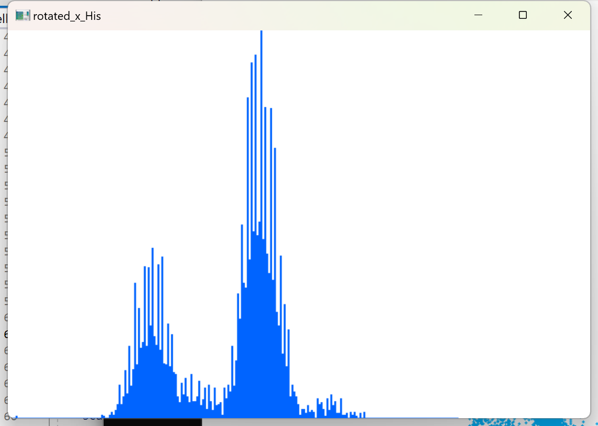

# 20230630更新
20230629文件夹新增*utils.cpp*和*utils.h*文件  
20230630文件夹新增*rotateutils.cpp*、*scatohis.cpp*、*rotateutils.h*文件  
## 对20230629文件夹的更新
将工具函数和业务代码区分开来，新增utils.cpp和utils.h文件，文件内容为20230629的绘制直方图工具函数的整合  
其中histogram.cpp为绘制直方图业务逻辑的代码  
## 20230630作业
### *rotateutils.cpp*
计算旋转直方图的工具函数实现  
主要功能函数如下  
```
//计算直方图函数
vector<int> calHist(const vector<double>& data, double binsize);
{
    return histogram;
}

```
calHist()函数返回经过计算好的直方图数据，再调用drawHist()函数绘制直方图即可
```
// 计算点的旋转函数
vector<csvPoint> rotatePoints(const vector<csvPoint>& points, double angle);
{
    return rotated_points;
}
```
rotatePoints()函数返回经过旋转的点
### *scatohis.cpp*
计算对散点图进行旋转后的直方图的业务逻辑代码  
主要实现了  
*原数据散点图与直方图的显示*  
*旋转之后的散点图与直方图的显示*

### *rotateutils.h*
头文件，声明*rotateutils.cpp*文件中类的成员函数

## 作业难点及分析
### 点的旋转
在作业初期，我期望通过使用opencv来读取散点图的方法来绘制直方图  
后续发现这样做会增加算力负担

解决：在rotatePoints()函数中使用数学方法，对坐标，也就是数据中的x,y直接进行旋转，加快了计算速度，也使得直方图绘制更精确  
### 直方图的锯齿问题
在绘制直方图的过程中，产生了一定的直方图锯齿问题(如下图)    
  
*产生问题的原因1：*  
没有设置好正确的步长，也就是组距  
*原因2：*  
数据经过旋转之后，会产生小数，在经过calHist()函数处理后会返回整数，导致单个步长之间数据分布不均匀，从而导致产生锯齿状图像  
总的来说依旧是步长问题，导致数据在经过旋转之后产生锯齿状直方图  
*解决方案：*  
在代码中对直方图设置自定义步长  
在旋转之后减小直方图步长  
优化后效果如下图
*尝试使用的解决方案：*
使用64位浮点数图像，让cv可以接受非整数矩阵输入

